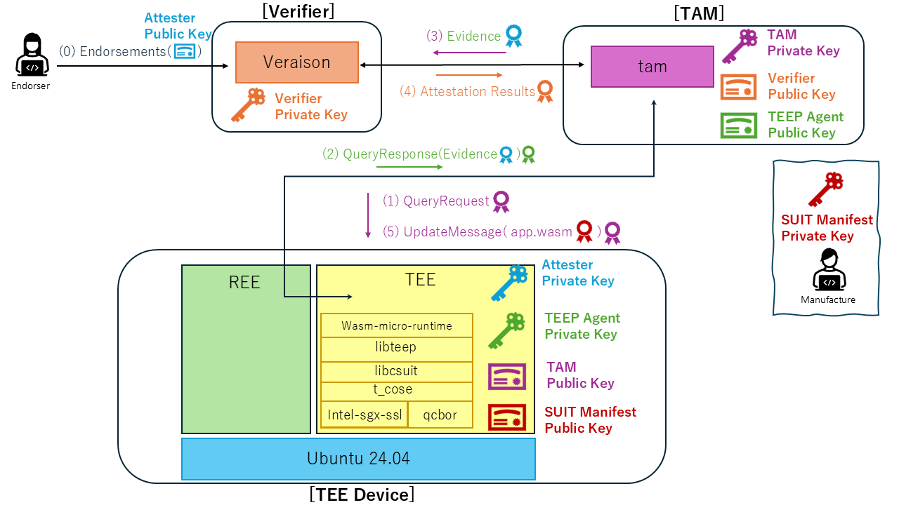

# TAWS: A TEEP Agent for Wasm on Intel SGX

TAWS (pronounced "tohz") contains an implementation of a TEEP Agent.
The original design goal of the TEEP Agent is to support installation and update of any WebAssembly (Wasm) applications inside a TEE.
However, in the current implementation, the TEE Device is specialized for executing a YOLOv8 WebAssembly module for image processing.
Therefore, any Wasm applications are not supported at this stage.
The TAM and Verifier components are maintained in separate repositories.
This repository focuses on building and running the TEEP Agent in Intel SGX hardware mode.
By combining this SGX-based TEEP Agent with the corresponding TAM and Verifier, the full TEEP provisioning flow can be executed with SGX DCAP evidence.




## Directory Structure

````
📁 taws
├── 📁 App (application sources)
├── 📁 Enclave (enclave sources)
├── 📁 yolov8-frontend (Go CLI + Web-UI implementation and entrypoint)
├── 📁 doc (documentation assets)
├── 📁 common (Shared definitions and interfaces used by both App and Enclave)
├── 📁 scripts (build helper scripts)
├── 📁 third_party (TEEP dependencies tracked as git submodules)
│   ├── 📁 libcsuit
│   ├── 📁 libteep
│   ├── 📁 QCBOR
│   ├── 📁 t_cose
│   ├── 📁 intel-sgx-ssl
│   ├── 📁 wasm-micro-runtime
│   └── 📁 intel-dcap-pccs
├── 📄 Makefile
├── 📄 Makefile.test
├── 📄 Makefile.sgx.test
└── 📄 README.md
````

The TEE Device uses the following libraries.
* [libcsuit](https://github.com/kentakayama/libcsuit)
* [libteep](https://github.com/kentakayama/libteep)
* [QCBOR](https://github.com/laurencelundblade/QCBOR)
* [t_cose](https://github.com/laurencelundblade/t_cose)
* [intel-sgx-ssl](https://github.com/intel/intel-sgx-ssl)
* [wasm-micro-runtime](https://github.com/bytecodealliance/wasm-micro-runtime)
* [intel-dcap-pccs](https://github.com/intel/confidential-computing.tee.dcap.pccs)


## Getting started

### Clone the Repository

This repository uses git submodules for `third_party` dependencies.

```bash
git clone --recurse-submodules https://github.com/yuma-nishi/taws.git
cd taws
```

### Prerequisites

TAWS supports both native and Docker-based workflows.
Both workflows require an Intel SGX hardware-mode environment that supports DCAP quote generation.

Before building or running TAWS, configure the Intel SGX software stack and DCAP infrastructure:
- Intel SGX SDK, PSW, and DCAP components 
  - See the [Intel SGX Linux software stack](https://github.com/intel/confidential-computing.sgx) and Intel's [QuoteGeneration](https://github.com/intel/confidential-computing.tee.dcap/tree/main/QuoteGeneration) documentation.
- PCCS (Provisioning Certificate Caching Service)
  - See [`third_party/intel-dcap-pccs/service/README.md`](./third_party/intel-dcap-pccs/service/README.md). 
  - You will need an Intel PCS (Provisioning Certification Service) API key from the [Intel Trusted Services Portal](https://api.portal.trustedservices.intel.com/provisioning-certification).

### Native Workflow
Build and run TAWS directly on the SGX host.

#### Requirements
- Go 1.22 or later
- Ubuntu 24.04 LTS (tested environment)

Other Linux distributions may work but have not been verified.

#### Build and Run

```bash
# install third_party dependencies
cd scripts/ && ./build_third_party.sh

# build for SGX hardware mode
cd .. && make SGX_MODE=HW SGX_DEBUG=1

# run the taws web server on the host
./build/go/taws web
```
For Web Server usage (with diagram), CLI usage details, and full options, see [User Manual](./doc/USER_MANUAL.md) (especially [Web Server](./doc/USER_MANUAL.md#web-server)).

If you need a simulation-only development build, use `make SGX_MODE=SIM` instead. 
SGX DCAP evidence and PCCS are hardware-mode requirements.

### Docker Workflow
The Docker workflow builds and runs TAWS inside a single container. By default,
the image uses the Intel DCAP default QPL with PCCS and AESM running in the
container. Setting `TAWS_DCAP_PROVIDER=azure` is the only special case: it
installs the Azure DCAP Client for Azure SGX VMs and skips container PCCS/AESM
startup.

#### Requirements
- Docker

#### Build
Prepare the local `sgx_sample_deb` base image:

```bash
cd scripts/
./prepare_sgx_base_image.sh
```

Build the default TAWS Docker image. No `--build-arg` is required for the
container PCCS/AESM configuration:

```bash
cd ..
docker build -t taws:pccs .
```

For Azure SGX VMs, build with the Azure DCAP provider:

```bash
docker build --build-arg TAWS_DCAP_PROVIDER=azure -t taws:azure .
```

#### Run on a PCCS-backed SGX Host
Run TAWS on an SGX hardware host using Docker. PCCS and AESM run inside the
`taws:pccs` container for SGX quote generation.

```bash
docker run --rm -it \
  --network host \
  --device /dev/sgx_enclave \
  --device /dev/sgx_provision \
  -p 8181:8181 \
  -e PCCS_API_KEY=<your-intel-pcs-api-key> \
  taws:pccs
```

Optional runtime settings can be passed with additional `-e` flags:
`PCCS_PROXY`, `PCCS_CACHING_MODE`, `TAWS_WEB_ADDR`, and `TAWS_TAM_URL`.

#### Run on an Azure SGX VM
Run the Azure image with host networking and the Azure SGX device paths. In this
mode the entrypoint unsets `SGX_AESM_ADDR` and starts TAWS without container
PCCS/AESM services.

```bash
docker run --rm -it \
  --network host \
  --device /dev/sgx_enclave:/dev/sgx_enclave \
  --device /dev/sgx_provision:/dev/sgx_provision \
  taws:azure
```

`TAWS_WEB_ADDR` and `TAWS_TAM_URL` can be overridden with `-e` flags in both
Docker modes.

### Attestation Configuration
By default, builds use `SGX_EVIDENCE=1` and generate SGX DCAP Evidence for the `QueryResponse` attestation payload. 
`SGX_EVIDENCE=0` is available as a development and compatibility mode for the generic EAT payload. 
For details of the interface between the TEEP Agent and TAM, see [external-design-teep-tam-exchange.md](./doc/external-design-teep-tam-exchange.md).


## Design Documents

Design docs are organized by audience and hierarchy.

### External Design (for TAM developers , Web/CLI client implementers)

- [ExternalDesignDocument.md](./doc/ExternalDesignDocument.md)
  - Audience: TAM developers , Web/CLI client implementers
  - Purpose: External behavior and interface overview of the TEE Device.
  - Includes:
    - [external-design-web-ui-api.md](./doc/external-design-web-ui-api.md)
      - Audience: Web/CLI client implementers
      - Purpose: Web UI API contract (`/teep`, `/detect`) and UI-facing error behavior.
    - [external-design-teep-tam-exchange.md](./doc/external-design-teep-tam-exchange.md)
      - Audience: TAM developers
      - Purpose: TEEP-over-HTTP exchange contract between TEE Device and TAM.

### Internal Design (for TEE maintainers)

- [InternalDesignDocument.md](./doc/InternalDesignDocument.md)
  - Audience: TEE maintainers
  - Purpose: Internal architecture overview, high-level flow.
  - Related details:
    - [enclave-process-message.md](./doc/enclave-process-message.md)
      - Audience: TEE maintainers / REE-side developers (ECALL callers)
      - Purpose: High-level flow and state behavior of `ecall_process_message`.
    - [suit-processor.md](./doc/suit-processor.md)
      - Audience: TEE maintainers
      - Purpose: SUIT callback-wrapper flow, entry points, and failure behavior summary.
    - [tc-manager.md](./doc/tc-manager.md)
      - Audience: TEE maintainers
      - Purpose: TC record lifecycle and record update policy.
    - [invoke_wasm.md](./doc/invoke_wasm.md)
      - Audience: TEE maintainers / REE-side developers (ECALL callers)
      - Purpose: `ecall_invoke_wasm` flow and failure behavior summary.


# Acknowledgement

This work was supported by JST K Program Grant Number JPMJKP24U4, Japan.
