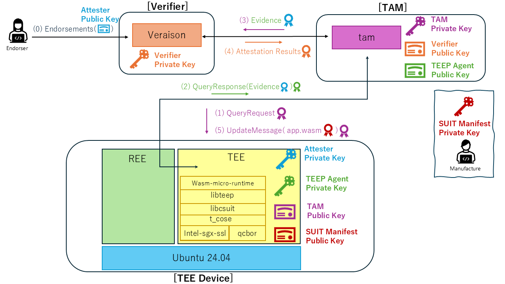

# TAWS: A TEEP Agent for Wasm on Intel SGX

TAWS (pronounced "tohz") contains an implementation of a TEEP Agent.
The original design goal of the TEEP Agent is to support installation and update of any WebAssembly (Wasm) applications inside a TEE.
However, in the current implementation, the TEE Device is specialized for executing a YOLOv8 WebAssembly module for image processing.
Therefore, any Wasm applications are not supported at this stage.
The TAM and Verifier components are maintained in separate repositories.
This repository focuses on building and running the TEEP Agent in Intel SGX hardware mode.
By combining this SGX-based TEEP Agent with the corresponding TAM and Verifier, the full TEEP provisioning flow can be executed with SGX DCAP evidence.




## Directory Structure

````
📁 taws
├── 📁 App (application sources)
├── 📁 Enclave (enclave sources)
├── 📁 yolov8-frontend (Go CLI + Web-UI implementation and entrypoint)
├── 📁 doc (documentation assets)
├── 📁 common (Shared definitions and interfaces used by both App and Enclave)
├── 📁 scripts (build helper scripts)
├── 📁 third_party (TEEP dependencies tracked as git submodules)
│   ├── 📁 libcsuit
│   ├── 📁 libteep
│   ├── 📁 QCBOR
│   ├── 📁 t_cose
│   ├── 📁 intel-sgx-ssl
│   └── 📁 wasm-micro-runtime
├── 📄 Makefile
├── 📄 Makefile.test
├── 📄 Makefile.sgx.test
└── 📄 README.md
````

The TEE Device uses the following libraries.
* [libcsuit](https://github.com/kentakayama/libcsuit)
* [libteep](https://github.com/kentakayama/libteep)
* [QCBOR](https://github.com/laurencelundblade/QCBOR)
* [t_cose](https://github.com/kentakayama/t_cose)
* [intel-sgx-ssl](https://github.com/intel/intel-sgx-ssl)
* [wasm-micro-runtime](https://github.com/bytecodealliance/wasm-micro-runtime)

Intel SGX DCAP and PCCS are runtime/platform dependencies installed from Intel SGX/DCAP packages, not source dependencies tracked in this repository.


## Getting started

### Clone the Repository

This repository uses git submodules for `third_party` dependencies.

```bash
git clone --recurse-submodules https://github.com/yuma-nishi/taws.git
cd taws
```

### Prerequisites

TAWS supports both native and Docker-based workflows.
Hardware-mode runs require an Intel SGX host.

Before building or running TAWS, make sure the target environment has:
- Intel SGX hardware for hardware-mode execution
- Host [SGX driver/kernel](https://github.com/intel/linux-sgx-driver) support with `/dev/sgx_enclave` and `/dev/sgx_provision`

### Docker Workflow
The Docker workflow is the shortest path to a runnable TAWS Web UI.

TAWS supports two Docker modes:
- PCCS mode: for a standard SGX host using Intel PCCS.
- Azure mode: for Azure SGX VMs using Azure DCAP Client.

#### Requirements
- Docker
- Intel SGX-capable hardware
- Host SGX driver/kernel support
- Host SGX device nodes at `/dev/sgx_enclave` and `/dev/sgx_provision`

#### Run on a PCCS-backed SGX Host
Use this mode on a PCCS-backed SGX host.

Build the image:
```bash
docker build -t taws:pccs .
```

Run the container:
```bash
docker run --rm -it \
  --network host \
  --device /dev/sgx_enclave:/dev/sgx_enclave \
  --device /dev/sgx_provision:/dev/sgx_provision \
  -e PCCS_API_KEY=<your-intel-pcs-api-key> \
  -e TAWS_LOG_LEVEL=info \
  taws:pccs
```

`PCCS_API_KEY` is required in this mode. 
Obtain it from the [Intel Trusted Services Portal](https://api.portal.trustedservices.intel.com/provisioning-certification).

Optional runtime settings can be passed with additional `-e` flags:
`PCCS_PROXY`, `PCCS_CACHING_MODE`, `TAWS_WEB_ADDR`, `TAWS_TAM_URL`, and `TAWS_LOG_LEVEL`. 
Supported log levels are `error`, `info`, and `debug`.

#### Run on an Azure SGX VM
Use this mode on an Azure SGX VM.

Build the image:
```bash
docker build --build-arg TAWS_DCAP_PROVIDER=azure -t taws:azure .
```

Run the container:
```bash
docker run --rm -it \
  --network host \
  --device /dev/sgx_enclave:/dev/sgx_enclave \
  --device /dev/sgx_provision:/dev/sgx_provision \
  -e TAWS_LOG_LEVEL=info \
  taws:azure
```

Supported `TAWS_LOG_LEVEL` values are `error`, `info`, and `debug`.

### Native Workflow
Build and run TAWS directly on the SGX host.

#### Requirements
- Go 1.22 or later
- Ubuntu 24.04 LTS (tested environment)
- Intel SGX hardware and host SGX driver/kernel support with `/dev/sgx_enclave` and `/dev/sgx_provision`

For the native workflow, set up the Intel SGX SDK/PSW from the [Intel SGX Linux software stack](https://github.com/intel/confidential-computing.sgx) and the DCAP quote generation components described in Intel's [QuoteGeneration](https://github.com/intel/confidential-computing.tee.dcap/tree/main/QuoteGeneration) documentation. The Ubuntu 24.04 package list below covers the common build and SGX development packages used by this repository; platform-specific quote provider setup follows in the Azure and PCCS-backed sections.

For Ubuntu 24.04, configure the Intel SGX apt repository first, then install the packages:

```bash
sudo apt-get update
sudo apt-get install -y \
  ca-certificates cmake curl gcc g++ git gnupg lsb-release make openssl perl \
  pkgconf build-essential libboost-dev libboost-system-dev libboost-thread-dev \
  libcurl4-openssl-dev libprotobuf-c-dev libssl-dev protobuf-c-compiler \
  protobuf-compiler python-is-python3 wget zip \
  libsgx-ae-pce libsgx-enclave-common libsgx-headers \
  libsgx-dcap-ql libsgx-dcap-ql-dev
```

Other Linux distributions may work but have not been verified.

#### Run natively on an Azure SGX VM
Use this path when TAWS runs directly on an Azure SGX VM.

Add Microsoft's Ubuntu 22.04 package repository, then install `az-dcap-client` as the Azure quote provider integration for the native workflow:

```bash
wget -q https://packages.microsoft.com/config/ubuntu/22.04/packages-microsoft-prod.deb
sudo dpkg -i packages-microsoft-prod.deb
rm -f packages-microsoft-prod.deb
sudo apt-get update
sudo apt-get install -y az-dcap-client
```

A local PCCS instance and an Intel PCS API key are normally not required in this mode because the Azure DCAP Client provides the DCAP quote provider integration for Azure.

After `az-dcap-client` is installed, use the common build and run commands below.

#### Run natively on a PCCS-backed SGX Host
Use this path when TAWS runs directly on a non-Azure SGX hardware host backed by PCCS.

PCCS requires an Intel PCS API key from the [Intel Trusted Services Portal](https://api.portal.trustedservices.intel.com/provisioning-certification).

For the PCCS-backed native path, also install the default QPL development package and AESM quote-ex plugin after configuring the Intel SGX apt repository:

```bash
sudo apt-get install -y libsgx-dcap-default-qpl libsgx-dcap-default-qpl-dev libsgx-aesm-quote-ex-plugin
```

If PCCS runs locally on the host, install `nodejs` and `npm` for the PCCS service.

After installing PCCS, configure it according to the Intel PCCS service README: [`confidential-computing.tee.dcap.pccs/service/README.md`](https://github.com/intel/confidential-computing.tee.dcap.pccs/blob/main/service/README.md).

After AESM and PCCS are ready, use the common build and run commands below.

#### Common Build and Run

```bash
# load SGX SDK environment variables for sgx_edger8r, sgx_sign, and libraries
source /opt/intel/sgxsdk/environment

# install third_party dependencies
./scripts/build_third_party.sh

# build for SGX hardware mode
make SGX_MODE=HW SGX_DEBUG=1

# run the taws web server on the host
./build/go/taws web
```
For Web Server usage (with diagram), CLI usage details, and full options, see [User Manual](./doc/USER_MANUAL.md) (especially [Web Server](./doc/USER_MANUAL.md#web-server)).

If you need a simulation-only development build, use `make SGX_MODE=SIM` instead.
SGX DCAP evidence, PCCS, AESM, and Azure DCAP Client setup are hardware-mode requirements and are not needed for simulation-only development builds.

### Attestation Configuration
By default, builds use `SGX_EVIDENCE=1` and generate SGX DCAP Evidence for the `QueryResponse` attestation payload. 
`SGX_EVIDENCE=0` is available as a development and compatibility mode for the generic EAT payload. 
For details of the interface between the TEEP Agent and TAM, see [external-design-teep-tam-exchange.md](./doc/external-design-teep-tam-exchange.md).


## Design Documents

Design docs are organized by audience and hierarchy.

### External Design (for TAM developers , Web/CLI client implementers)

- [ExternalDesignDocument.md](./doc/ExternalDesignDocument.md)
  - Audience: TAM developers , Web/CLI client implementers
  - Purpose: External behavior and interface overview of the TEE Device.
  - Includes:
    - [external-design-web-ui-api.md](./doc/external-design-web-ui-api.md)
      - Audience: Web/CLI client implementers
      - Purpose: Web UI API contract (`/teep`, `/detect`) and UI-facing error behavior.
    - [external-design-teep-tam-exchange.md](./doc/external-design-teep-tam-exchange.md)
      - Audience: TAM developers
      - Purpose: TEEP-over-HTTP exchange contract between TEE Device and TAM.

### Internal Design (for TEE maintainers)

- [InternalDesignDocument.md](./doc/InternalDesignDocument.md)
  - Audience: TEE maintainers
  - Purpose: Internal architecture overview, high-level flow.
  - Related details:
    - [enclave-process-message.md](./doc/enclave-process-message.md)
      - Audience: TEE maintainers / REE-side developers (ECALL callers)
      - Purpose: High-level flow and state behavior of `ecall_process_message`.
    - [evidence-generation.md](./doc/evidence-generation.md)
      - Audience: TEE maintainers / TAM and Verifier developers
      - Purpose: SGX DCAP Evidence generation, quote binding, and verifier responsibilities.
    - [suit-processor.md](./doc/suit-processor.md)
      - Audience: TEE maintainers
      - Purpose: SUIT callback-wrapper flow, entry points, and failure behavior summary.
    - [tc-manager.md](./doc/tc-manager.md)
      - Audience: TEE maintainers
      - Purpose: TC record lifecycle and record update policy.
    - [invoke_wasm.md](./doc/invoke_wasm.md)
      - Audience: TEE maintainers / REE-side developers (ECALL callers)
      - Purpose: `ecall_invoke_wasm` flow and failure behavior summary.


# Acknowledgement

This work was supported by JST K Program Grant Number JPMJKP24U4, Japan.
