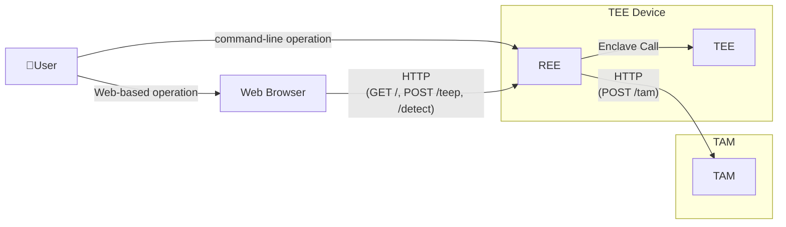

# Attester External Design Document

## 1. Purpose
This document defines the external behavior of the Attester, including user-visible structure, interfaces, and inputs/outputs.

---

## 2. Preconditions and Constraints
### 2.1 Preconditions
- The TEE runs in Intel SGX simulation mode.
- The TAM is started before the Attester.
- Network connectivity is available.

### 2.2 Constraints
- Authentication and authorization are not implemented.
- HTTPS is not supported (HTTP only).
- Concurrent multiple requests are out of scope.

---

## 3. System Overview
The TEE Device receives image input from a Web Browser or CLI, executes a WASM app (for example, YOLOv8) inside the TEE, and returns inference results.
It also communicates with the TAM over HTTP to run the app provisioning session.

---

## 4. System Components
The system consists of the following components:

- User
  - Requests inference and TEEP session execution from a Web Browser or CLI.
- TEE Device
  - Provides Web UI/CLI, executes WASM apps via the TEE, and processes TEEP sessions.
- TAM
  - Receives TEEP messages and returns target manifests for installation.

---
This diagram shows the connection paths and HTTP interfaces visible from users and the external TAM system.

### 5.2 Interface List

| Category | Method | Path | Summary |
| --- | --- | --- | --- |
| Web Browser -> REE | GET | `/` | Display Web UI |
| Web Browser -> REE | POST | `/teep` | Run TEEP session |
| Web Browser -> REE | POST | `/detect` | Upload image and run inference |
| REE -> TAM | POST | `/tam` | Send/receive TEEP messages |

Supplement: For detailed interface specifications, see [external-design-web-ui-api.md](./external-design-web-ui-api.md) and [external-design-teep-tam-exchange.md](./external-design-teep-tam-exchange.md).
