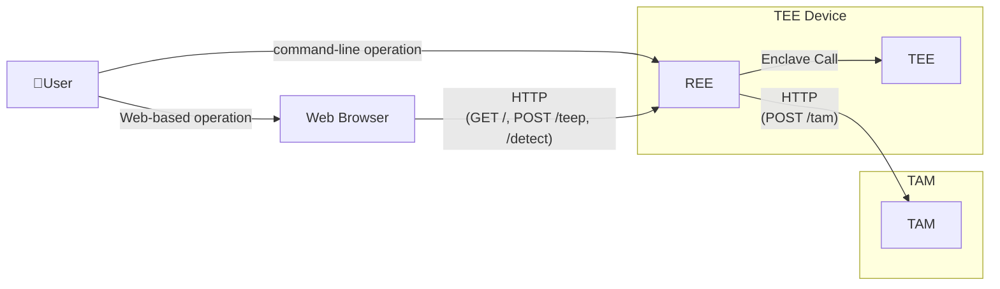

# Attester External Design Document

## 1. Purpose
This document defines the external behavior of the Attester, including user-visible structure, interfaces, and inputs/outputs.

---

## 2. Preconditions and Constraints
### 2.1 Preconditions
- The TEE runs in Intel SGX simulation mode.
- The TAM is started before the Attester.
- Network connectivity is available.

### 2.2 Constraints
- Authentication and authorization are not implemented.
- HTTPS is not supported (HTTP only).
- Concurrent multiple requests are out of scope.

---

## 3. System Overview
The TEE Device receives image input from a Web Browser or CLI, executes a WASM app (for example, YOLOv8) inside the TEE, and returns inference results.
It also communicates with the TAM over HTTP to run the app provisioning session.

---

## 4. System Components
The system consists of the following components:

- User
  - Requests inference and TEEP session execution from a Web Browser or CLI.
- TEE Device
  - Provides Web UI/CLI, executes WASM apps via the TEE, and processes TEEP sessions.
- TAM
  - Receives TEEP messages and returns target manifests for installation.

---

## 5. Interface Specification

### 5.1 Connectivity
This diagram shows the connection paths and HTTP interfaces visible from users and the external TAM system.

### 5.2 Interface List
#### 5.2.1 Web UI (HTTP)
| Category | Method | Path | Summary |
| --- | --- | --- | --- |
| Web Browser -> REE | GET | `/` | Display Web UI |
| Web Browser -> REE | POST | `/teep` | Run TEEP session |
| Web Browser -> REE | POST | `/detect` | Upload image and run inference |
| REE -> TAM | POST | `/tam` | Send/receive TEEP messages |

For CLI usage and options, see `README.md`.

### 5.3 Web UI API
#### 5.3.1 `POST /teep`
| Item | Description |
| --- | --- |
| Request | Method: `POST` / Path: `/teep` / Body: empty |
| Response (`200 OK`) | If ECALL result is `ECALL_PROCESS_TEEP_RESULT_DEVICE_ACTIVATION_FLOW`, Body: `The device has been activated. You can install the app.` |
| Response (`200 OK`) | If ECALL result is `ECALL_PROCESS_TEEP_RESULT_OK`, Body: `TEEP install finished.` |
| Response (`500 Internal Server Error`) | If enclave initialization fails, Body: `install failed` |
| Response (`500 Internal Server Error`) | If TEEP session fails, Body: `install failed` |

#### 5.3.2 `POST /detect`
| Item | Description |
| --- | --- |
| Request | Method: `POST` / Path: `/detect` / Content-Type: `multipart/form-data` / Field: `image` |
| Response (`200 OK`) | `image/jpeg` (processed image) |
| Response (`400 Bad Request`) | If multipart format is invalid, Body: `invalid multipart form` |
| Response (`400 Bad Request`) | If `image` is missing, Body: `missing image` |
| Response (`400 Bad Request`) | If reading `image` fails, Body: `read image failed` |
| Response (`400 Bad Request`) | If `image` is empty, Body: `empty image` |
| Response (`500 Internal Server Error`) | If inference execution fails, Body: `invoke detector failed` |

#### 5.3.3 UI Display Policy
- If `POST /teep` returns `200`, the Web UI displays the response body.
- If status is not `200`, the Web UI displays `TEEP install failed. Check server logs.`
- If `POST /detect` fails, the Web UI displays `Detection failed. Check server logs.`
- External error messages are fixed strings. For detailed causes, check Attester process logs (stdout/stderr).

### 5.4 TEEP Message Exchange with TAM
#### 5.4.1 `POST /tam`
| Item | Description |
| --- | --- |
| Request | Method: `POST` / Path: `<configured TAM URL>` / Body: COSE-wrapped TEEP message (CBOR). Main outgoing message types are `QUERY_RESPONSE`, `SUCCESS_MESSAGE`, and `ERROR_MESSAGE` (for field-level details, see [enclave-process-message.md](./enclave-process-message.md)). |
| Response (`200 OK`) | Body: COSE-wrapped TEEP message (CBOR) from TAM. Main incoming message types are `QUERY_REQUEST` and `UPDATE`. |
| Response (`204 No Content`) | Empty body. This is treated as normal session end. |
| Response (HTTP error status) | HTTP response is received with non-2xx status (for example `500`). The session is treated as failed. |
