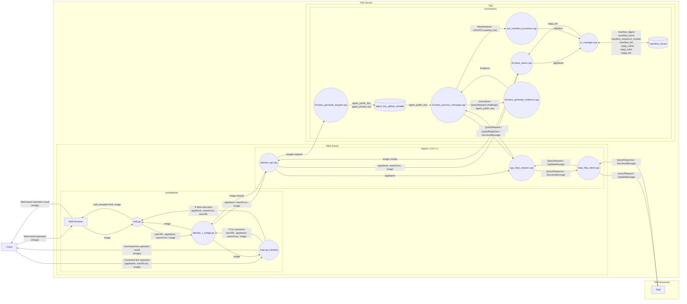

# Internal Design Document

## 1. Purpose and Scope
This document provides an internal overview of the TEE Device design.
Detailed specifications for each module are documented in separate internal design documents.
This document focuses on high-level flow and module responsibilities.

## 2. Architecture Overview
### 2.1 Components and Roles inside the TEE Device
- `cmd/attester` (Go):
  - CLI/Web entry points
  - Calls App-layer APIs through the C bridge
- `App` (REE-side C/C++):
  - Calls Enclave ECALLs
  - Controls TEEP message send/receive flow
- `Enclave` (TEE-side C/C++):
  - Handles Query/Update processing as a TEEP Agent
  - Runs SUIT processing through SUIT-Manifest-Processor
  - Manages Trusted Components (TC) through TC-Manager
  - Executes WASM through WAMR

TODO: Update this figure to a simpler DFD.

## 3. Processing Flow Overview
### 3.1 TEEP Flow
- A TEEP message received on the REE side is passed to the TEEP Agent in the Enclave.
- The TEEP Agent verifies the received COSE-signed TEEP message.
  After successful verification, it checks the message `type` and runs `QueryRequest` or `UpdateMessage` processing.
  - `type == QUERY_REQUEST`: checks whether the request is supported by this implementation, and generates a QueryResponse (including Evidence and TC information when required). If the request is not supported, it generates `TEEP_ERROR`.
  - `type == UPDATE`: verifies and processes the received manifest with SUIT. On success, it stores or updates app information in records managed by TC-Manager. On failure, it returns `TEEP_ERROR`.
- On success, it returns a SUCCESS message, and the target app becomes executable in the Enclave.
- Details:
  - Query/Update processing: [enclave-process-message.md](./enclave-process-message.md)
  - SUIT processing: [suit-processor.md](./suit-processor.md)
  - TC management: [tc-manager.md](./tc-manager.md)

### 3.2 WASM Execution Flow
- Preconditions:
  - The TC-Manager records already contain information for the target app (identifier, binary, etc.).
- REE-side processing:
  - A REE API (for example, `ecall_invoke_wasm`) is called to start the Enclave ECALL for WASM execution.
- Enclave-side processing:
  - The app name from the REE side is used to find the target app in TC-Manager records.
  - The target WASM binary is loaded and executed with WAMR.
- Return:
  - Execution results (success/failure and output data) are returned to the REE side through ECALL.
- Details: [invoke_wasm.md](./invoke_wasm.md)

## 4. Module Design Documents
| Module | Role | Design Document |
| --- | --- | --- |
| `App` | Aggregates TEEP session results and returns public APIs | [attester-app-design.md](./attester-app-design.md) |
| `cmd/attester` | Go bridge APIs and Web/CLI display control | [cmd-attester-go-design.md](./cmd-attester-go-design.md) |
| `Enclave_process_message` | Processes TEEP messages | [enclave-process-message.md](./enclave-process-message.md) |
| `tc_manager` | Manages TC records | [tc-manager.md](./tc-manager.md) |
| `suit_manifest_process` | Processes SUIT manifests | [suit-processor.md](./suit-processor.md) |
| `invoke_wasm` | Controls WASM execution | [invoke_wasm.md](./invoke_wasm.md) |
