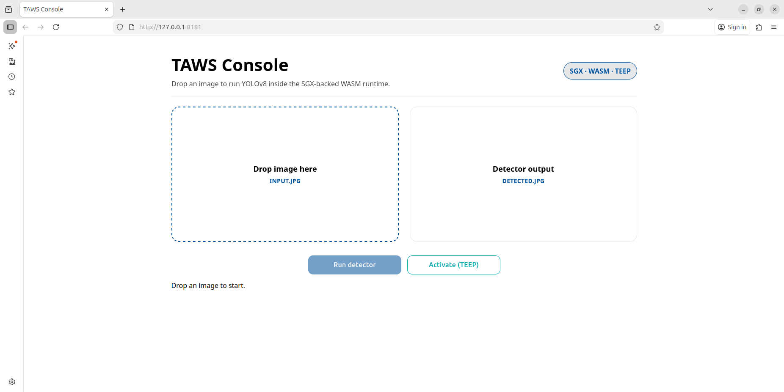
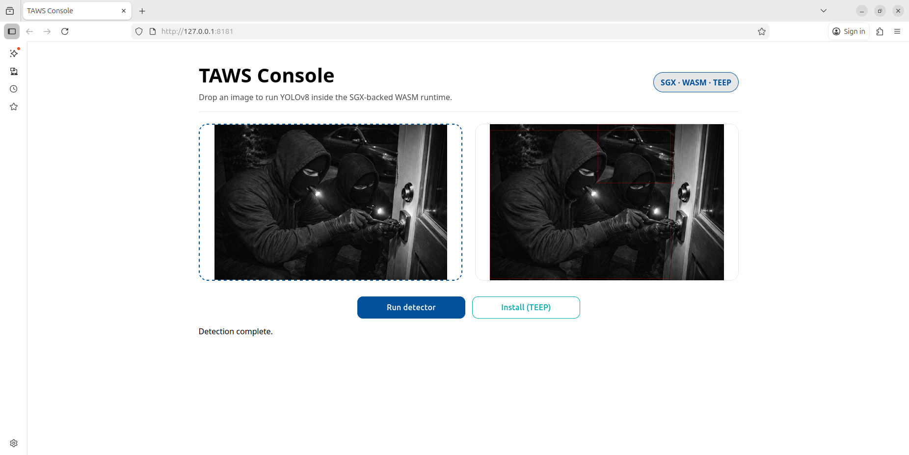

# TAWS User Manual

## Purpose
This document explains how to run and use the TAWS frontend (`./build/go/taws`) with Intel SGX hardware mode and DCAP Evidence support.
It covers Web Server usage, CLI usage, available options, and test commands.

## Scope
- Target binary: `./build/go/taws`
- Target modes: `web`, `cli`
- Related setup/build steps: [README Getting started](../README.md#getting-started)

## Runtime Requirements
TAWS is configured for Intel SGX hardware mode by default. Running the SGX/DCAP flow requires:

- Intel SGX hardware and SGX hardware runtime.
- Intel SGX DCAP quote provider libraries.
- AESM service configured for DCAP quote generation.
- PCCS access configured for the platform.

The default build setting is `SGX_EVIDENCE=1`, which generates SGX DCAP Evidence for TEEP attestation. Use `SGX_EVIDENCE=0` only as a development or compatibility mode for the generic EAT payload.

## Running Modes
Usage:

```bash
./build/go/taws <subcommand> [options]
```

Subcommands:
- `web`: start Web Server
- `cli`: start interactive CLI

## Web Server
Start the Web Server:

```bash
./build/go/taws web
```

Usage:

```bash
./build/go/taws web [--addr ADDR] [--wapp NAME] [--func NAME] [--keygen yes|no] [--max-output BYTES] [--url URL]
```

Default URL:
- `http://127.0.0.1:8181`

Web page:
- Open the Web UI URL to display the initial screen. Click `Activate (TEEP)` first to register the device with the TAM. After successful activation, the button changes to `Install (TEEP)` so that the detector Wasm app can be installed.



- Click `Install (TEEP)` to start installation of the detector Wasm app.


- After installation, select an input image and click `Run detector` to process the image and display the annotated result.




Notes:
- The current `detector-yolov8` Wasm app expects JPEG input.
- `POST /detect` currently rejects uploads larger than `128 KiB`.
- Detection cost is affected not only by image dimensions but also by image content such as scene complexity, noise, and the number of candidate objects.
- In the current SGX/WAMR-based execution environment, some JPEG images may fail during inference even when their file size is small. If detection fails, restart the application and try a simpler image.

## CLI Usage
Start CLI:

```bash
./build/go/taws cli [--keygen yes|no]
```

CLI commands:

```bash
install [--url URL] [--wapp NAME]
detector [--wapp NAME] [--func NAME] [--max-output BYTES] <input.jpg> [output.jpg]
help
exit
```

Notes:
- `detector` expects a JPEG input file.
- Detection success in the current TEE demo depends on image characteristics as well as file size; some images with complex scenes may fail even if smaller images succeed.

## Options
### Common Option

| Option | Applies to | Description |
|---------|------------|-------------|
| `--keygen yes/no` | `cli`, `web` | Configure how the TEEP Agent key pair is prepared at startup: generate a new key pair (`yes`) or reuse an existing key (`no`). |

### CLI Command Options

| Option | Applies to | Description |
|---------|------------|-------------|
| `install --url URL` | `install` | Override the TAM URL. Default: `http://localhost:8080/tam`. |
| `install --wapp NAME` | `install` | WASM app name for install session. Default: `yolov8.wasm`. |
| `detector --wapp NAME` | `detector` | Target WAPP name for detector command. Default: `yolov8.wasm`. |
| `detector --func NAME` | `detector` | Function name to invoke. Default: `detector_yolov8_wasm`. |
| `detector --max-output BYTES` | `detector` | Maximum output bytes. Default: `16777216`. |

### Web Server Options

| Option | Description |
|---------|-------------|
| `web --addr ADDR` | Web server bind address. Default: `127.0.0.1:8181`. |
| `web --url URL` | TAM URL used by `POST /teep`. Default: `http://localhost:8080/tam`. |
| `web --wapp NAME` | WASM app name used by Web install/detect flow. Default: `yolov8.wasm`. |
| `web --func NAME` | WASM function used by Web detect flow. Default: `detector_yolov8_wasm`. |
| `web --max-output BYTES` | Maximum detector output bytes in Web mode. Default: `16777216`. |

## Tests
Run unit and non-SGX integration tests:

```bash
make -f Makefile.test run
```

Run SGX/DCAP integration tests:

```bash
make -f Makefile.sgx.test SGX_MODE=HW create-evidence-dcap-integration-test
make -f Makefile.sgx.test SGX_MODE=HW SGX_EVIDENCE=1 process-query-request-dcap-integration-test
```

Expected result:
- All test binaries complete successfully.
- SGX/DCAP tests may report `[SKIP]` when SGX hardware runtime or DCAP quote provider access is unavailable.
- Set `REQUIRE_DCAP=1` when SGX/DCAP unavailability should make the test fail instead of skip.
- `make` exits with status `0`.
