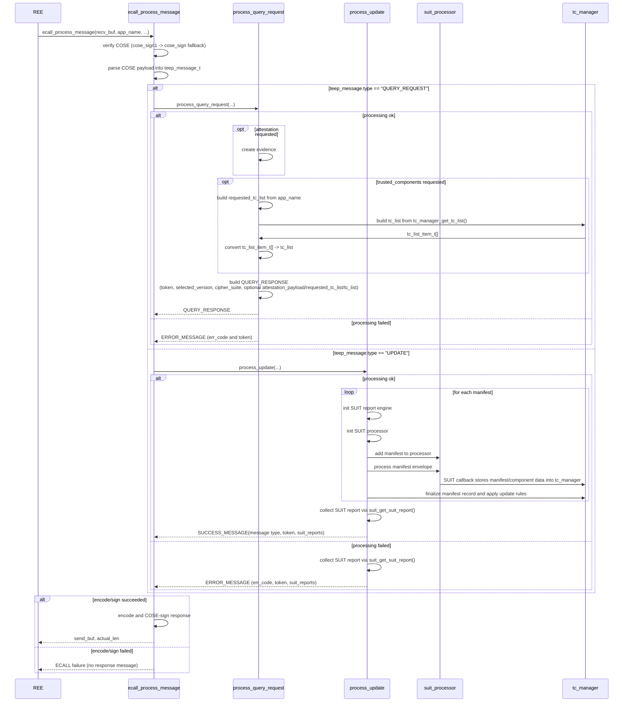

# QueryRequest and UpdateMessage Processing Design

## 1. Purpose
This document explains how the Enclave handles incoming TEEP messages and decides which response message to return.

## 2. Scope
- Implementation: `Enclave/src/Enclave_process_message.cpp`
- Public interface: `Enclave/Enclave.edl`
- Return type definition: `common/ecall_process_teep_result.h`

## 3. Public ECALL
### 3.1 `ecall_process_message`
```c
ecall_process_teep_result_t ecall_process_message(const uint8_t *recv_buf,
                                                  size_t recv_len,
                                                  const char *app_name,
                                                  uint8_t *send_buf,
                                                  size_t allocated_len,
                                                  size_t *actual_len);
```

Inputs:
- `recv_buf`, `recv_len`: COSE-wrapped TEEP message received from TAM
- `app_name`: App name requested for installation
- `send_buf`, `allocated_len`: Output buffer for the response COSE message and its maximum size (allocated on the REE side)

Outputs:
- `send_buf`: Encoded response TEEP message
- `actual_len`: Actual number of bytes written to `send_buf`

Main processing steps:
- Verify incoming COSE (`cose_sign1` first, then fallback to `cose_sign`)
- Decode TEEP message
- Handle Query Request or Update Message
- Encode response TEEP message as CBOR and sign it with COSE

## 4. Overview
`ecall_process_message` is an orchestration layer. Detailed logic is delegated to lower-level modules.

- `process_query_request`:
  - Builds `QUERY_RESPONSE` or `ERROR_MESSAGE`
- `process_update`:
  - Builds `SUCCESS_MESSAGE` or `ERROR_MESSAGE`

### 4.1 Sequence Diagram (`ecall_process_message`)
This diagram shows the main flow from receiving a message in `ecall_process_message` to returning the response to REE.


## 5. TEEP Agent State Transition
This state transition shows when the Enclave is ready to accept the next `QUERY_REQUEST` and when it is waiting for `UPDATE`.
- Initial state: `WAITING_QUERY_REQUEST`
- After building `QUERY_RESPONSE` (before encode/sign): transition to `WAITING_UPDATE_OR_QUERY_REQUEST`
- After building `SUCCESS_MESSAGE` (before encode/sign): transition to `WAITING_QUERY_REQUEST`
- On `ERROR_MESSAGE` generation or ECALL failure: no state transition

## 6. Processing Flow
### 6.1 Initial Checks and Message Parsing
1. Check `g_key_state` (TEEP Agent key initialization state in Enclave). If it is not `TEEP_KEY_READY`, stop processing and return an error.
2. Verify the incoming TEEP message signature (`teep_verify_cose_sign1`, then fallback to `teep_verify_cose_sign` on failure).
3. Convert the verified COSE payload (raw TEEP message bytes) to `teep_message_t` with `teep_set_message_from_bytes`.

### 6.2 On `QUERY_REQUEST` (`process_query_request`)
1. Check whether the received protocol version is supported.
   - If unsupported, return `ERROR_MESSAGE (UNSUPPORTED_MSG_VERSION)`.
2. Check whether `supported_teep_cipher_suites` includes at least one suite supported by this implementation.
   - If no compatible suite exists, return `ERROR_MESSAGE (UNSUPPORTED_CIPHER_SUITES)`.
3. If `attestation=true`, generate Evidence (`attestation_payload`) and set it in `QUERY_RESPONSE`.
4. If `trusted_components=true`, build `requested_tc_list` and `tc_list` and set them in `QUERY_RESPONSE`.
5. Return either `QUERY_RESPONSE` or `ERROR_MESSAGE` based on the above results.

Notes for `trusted_components=true`:
- `QUERY_RESPONSE` includes two fields:
  - `requested_tc_list`: target component requested by TAM (in this implementation, `app_name`)
  - `tc_list`: current component information held by Attester
- `requested_tc_list` is generated from `app_name` in SUIT `component-id` format (`[ bstr(app_name bytes) ]`).
- `tc_list` is generated by converting internal data from `tc_manager_get_tc_list()` into outgoing `tc-info` (CBOR) format.
  - key `0` (`system-component-id`): component name (`[ bstr(wapp_name bytes) ]`)
  - key `3` (`image-digest`): SHA-256 digest of binary (`<< [ -16, digest32 ] >>`)

### 6.3 On `UPDATE` (`process_update`)
1. Check token presence/length and `manifest_list` count. If conditions are not met, return `ERROR_MESSAGE (PERMANENT_ERROR)`.
2. Before processing each manifest, initialize SUIT report engine and SUIT processor, then set verification keys. If initialization fails, return `ERROR_MESSAGE (TEMPORARY_ERROR)`.
3. Add each manifest to processor and run `suit_process_envelope(...)`. If processing fails, return `ERROR_MESSAGE (MANIFEST_PROCESSING_FAILED)` (include `suit_reports` when available).
4. If processing succeeds, finalize the record with `tc_manager_check_and_update_record(...)`. If this fails, return `ERROR_MESSAGE (TEMPORARY_ERROR)`.
5. If all manifests succeed, return `SUCCESS_MESSAGE`. Include `suit_reports` only when `suit_get_suit_report()` succeeds.

### 6.4 Response Encoding and Signing
1. Convert the generated response message to CBOR.
2. Add COSE_Sign1 signature to the CBOR payload.

## 7. Output Message Specification of `ecall_process_message`

### 7.1 Response Types
| Incoming message | Condition | Response message |
| --- | --- | --- |
| `QUERY_REQUEST` | Success | `QUERY_RESPONSE` |
| `QUERY_REQUEST` | Version mismatch | `ERROR_MESSAGE` (`UNSUPPORTED_MSG_VERSION`) |
| `QUERY_REQUEST` | Cipher suite mismatch | `ERROR_MESSAGE` (`UNSUPPORTED_CIPHER_SUITES`) |
| `QUERY_REQUEST` | Evidence/`trusted_components` processing failed | `ERROR_MESSAGE` (`PERMANENT_ERROR` or `TEMPORARY_ERROR`) |
| `UPDATE` | Success | `SUCCESS_MESSAGE` |
| `UPDATE` | Invalid token / `manifest_list` | `ERROR_MESSAGE` (`PERMANENT_ERROR`) |
| `UPDATE` | Resource shortage / initialization failure | `ERROR_MESSAGE` (`TEMPORARY_ERROR`) |
| `UPDATE` | `suit_process_envelope` failed | `ERROR_MESSAGE` (`MANIFEST_PROCESSING_FAILED`) |
| Common | COSE verification failure / decode-encode-sign failure | none (ECALL failure) |

### 7.2 Fields Included in `QUERY_RESPONSE`
| Field | Type | Description |
| --- | --- | --- |
| `type` | `teep_type_t` | `TEEP_TYPE_QUERY_RESPONSE` |
| `contains` | `uint64_t` | Bit flags indicating included fields |
| `token` | `teep_buf_t` | Set when request contains token |
| `selected_version` | `uint32_t` | Selected protocol version (this implementation uses `0`) |
| `selected_teep_cipher_suite` | `teep_cipher_suite_t` | Selected TEEP cipher suite |
| `attestation_payload` | `teep_buf_t` | Evidence when request has `attestation=true` |
| `requested_tc_list` | `teep_requested_tc_info_array_t` | Requested TC list when `trusted_components=true` |
| `tc_list` | `teep_buf_array_t` | Existing TC list when `trusted_components=true` and data exists (CBOR array) |

### 7.3 Main Fields Included in `ERROR_MESSAGE` (`TEEP_TYPE_TEEP_ERROR`)
| Field | Type | Description |
| --- | --- | --- |
| `type` | `teep_type_t` | `TEEP_TYPE_TEEP_ERROR` |
| `contains` | `uint64_t` | Bit flags indicating included fields |
| `err_code` | `teep_err_code_t` | Error code that indicates failure reason |
| `token` | `teep_buf_t` | Set when token exists |
| `versions` | `teep_uint32_array_t` | Supported versions for `UNSUPPORTED_MSG_VERSION` |
| `supported_teep_cipher_suites` | `teep_cipher_suite_array_t` | Supported cipher suites for `UNSUPPORTED_CIPHER_SUITES` |
| `suit_reports` | `teep_buf_array_t` | Set when `MANIFEST_PROCESSING_FAILED` and SUIT report is available |

Errors caused by `QUERY_REQUEST`:
- Mainly return `PERMANENT_ERROR` or `TEMPORARY_ERROR`
- `err_msg` is currently unused (TODO: define short fixed templates per `err_code` as human-readable diagnostics, UTF-8 Net-Unicode, max 128 bytes, no sensitive data)

Errors caused by `UPDATE`:
- Return `PERMANENT_ERROR`, `TEMPORARY_ERROR`, or `MANIFEST_PROCESSING_FAILED`
- `err_msg` is currently unused (TODO)
- For `MANIFEST_PROCESSING_FAILED`, include `suit_reports` (TODO: consider adding signature to reports)

### 7.4 Fields Included in `SUCCESS_MESSAGE`
| Field | Type | Description |
| --- | --- | --- |
| `type` | `teep_type_t` | `TEEP_TYPE_TEEP_SUCCESS` |
| `contains` | `uint64_t` | Bit flags indicating included fields |
| `token` | `teep_buf_t` | Token from Update request |
| `suit_reports` | `teep_buf_array_t` | Set when SUIT report is available |

### 7.5 ECALL Return Value and Response Availability
| ECALL return value | Meaning | Response availability |
| --- | --- | --- |
| `ECALL_PROCESS_TEEP_RESULT_OK` (`0`) | Response was generated and returned normally. | Response message is available. |
| `ECALL_PROCESS_TEEP_RESULT_RESPONSE_IS_TEEP_ERROR` (`1`) | Response was generated and its TEEP message type is `ERROR_MESSAGE`. | Response message is available. |
| `ECALL_PROCESS_TEEP_RESULT_FATAL` (`2`) | Fatal processing failure (for example verify/decode/encode/sign failure). | Response message is not available. |
| `ECALL_PROCESS_TEEP_RESULT_DEVICE_ACTIVATION_FLOW` (`3`) | Response was generated and contains `QUERY_RESPONSE` with Evidence (`attestation_payload`). | Response message is available. |

## 8. Dependent Modules
| Module | Role | Detailed design |
| --- | --- | --- |
| `tc_manager` | Store TC records and apply update rules | [tc-manager.md](./tc-manager.md) |
| `suit_manifest_process` | Wrap SUIT callbacks and integrate SUIT processing | [suit-processor.md](./suit-processor.md) |
