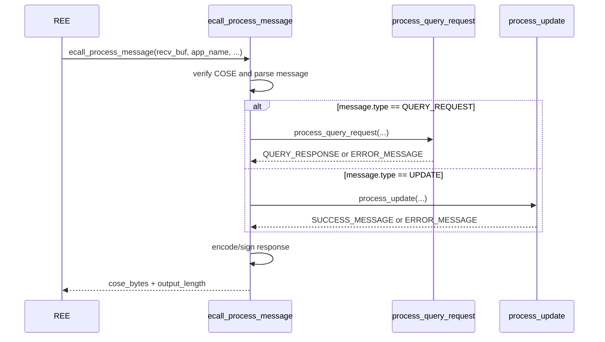

# QueryRequest and UpdateMessage Processing Design

## 1. Purpose
This document explains the high-level behavior of `ecall_process_message` for handover and maintenance.

## 2. Scope
- Implementation: `Enclave/src/Enclave_process_message.cpp`
- Public interface: `Enclave/Enclave.edl`
- Return type definition: `common/ecall_process_teep_result.h`

Normative field definitions for `QueryResponse` / `Error` / `Success` follow [draft-ietf-teep-protocol-21 section 4](https://datatracker.ietf.org/doc/html/draft-ietf-teep-protocol-21#section-4).
Detailed argument handling, field composition, and exact error mapping are implementation-defined; refer to source code.

## 3. Process Flow
Entry point: `ecall_process_message`.  
Detailed interface contract is documented in `Enclave/Enclave.edl` (ECALL declaration).

`ecall_process_message` is an orchestration layer.
- `process_query_request`: negotiates version/cipher suite, builds `QUERY_RESPONSE` (including requested evidence / trusted_components data), or returns `ERROR_MESSAGE` when validation/build fails.
- `process_update`: validates `token` / `manifest_list`, processes manifests via SUIT and updates TC records, then builds `SUCCESS_MESSAGE` (optionally with SUIT report) or returns `ERROR_MESSAGE`.

### 3.1 Sequence Diagram (`ecall_process_message`)

## 4. TEEP Agent State Transition
This section clarifies TEEP Agent state transitions and the message type the TEEP Agent is expected to accept next.
- Initial state: `WAITING_QUERY_REQUEST`
- After building `QUERY_RESPONSE` (before encode/sign): `WAITING_UPDATE_OR_QUERY_REQUEST`
- After building `SUCCESS_MESSAGE` (before encode/sign): `WAITING_QUERY_REQUEST`
- On `ERROR_MESSAGE` generation or ECALL fatal failure: no state transition

## 5. Response Behavior Summary
- Returned TEEP message type is one of `QUERY_RESPONSE`, `SUCCESS_MESSAGE`, or `ERROR_MESSAGE`.
- On fatal failures (for example COSE verification / parse / encode-sign failures), no response message is returned.

ECALL return value definitions are in `common/ecall_process_teep_result.h`.

## 6. `process_query_request` Evidence Generation
`process_query_request` generates attestation evidence only when `QueryRequest.data_item_requested.attestation` is true.

When attestation is requested, the evidence generation path is selected by the build-time `SGX_EVIDENCE` setting:

- `SGX_EVIDENCE=1`: call `create_evidence_dcap_envelope()` and build an SGX DCAP quote bundle.
- `SGX_EVIDENCE=0`: call `create_evidence_generic()` and build the generic EAT payload.

The SGX DCAP path performs the following operations:

1. Get Quoting Enclave target info through `ocall_get_qe_target_info`.
2. Create SGX report data from the TEEP Agent public key and `QueryRequest` challenge.
3. Call `sgx_create_report` for the Quoting Enclave target.
4. Get the required quote size through `ocall_get_quote_size`.
5. Get the DCAP quote through `ocall_get_quote`.
6. Encode the attestation payload as a CBOR array containing `raw-dcap-quote3` and `raw-report-data`.

If evidence generation fails, `process_query_request` returns an `ERROR_MESSAGE` with `TEEP_ERR_CODE_TEMPORARY_ERROR`.

## 7. Dependent Modules
| Module | Role | Detailed design |
| --- | --- | --- |
| `tc_manager` | Store TC records and apply update rules | [tc-manager.md](./tc-manager.md) |
| `suit_manifest_process` | Wrap SUIT callbacks and integrate SUIT processing | [suit-processor.md](./suit-processor.md) |
