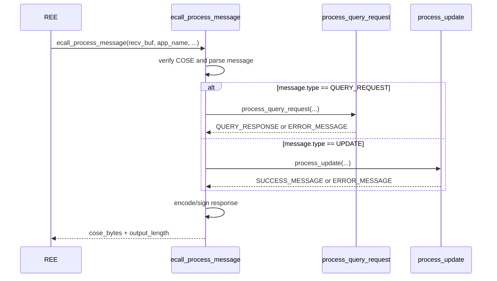

# QueryRequest and UpdateMessage Processing Design

## Audience and Intent
This document is for maintainers and handover engineers of the Enclave implementation.
Its purpose is to help readers quickly understand process flow, state transitions, and response behavior.

## 1. Purpose
This document explains the high-level behavior of `ecall_process_message` for handover and maintenance.

## 2. Scope
- Implementation: `Enclave/src/Enclave_process_message.cpp`
- Public interface: `Enclave/Enclave.edl`
- Return type definition: `common/ecall_process_teep_result.h`

Normative field definitions for `QueryResponse` / `Error` / `Success` follow [draft-ietf-teep-protocol-21 section 4](https://datatracker.ietf.org/doc/html/draft-ietf-teep-protocol-21#section-4).
Detailed argument handling, field composition, and exact error mapping are implementation-defined; refer to source code.

## 3. Process Flow
Entry point: `ecall_process_message`.
Detailed interface contract is documented in `Enclave/Enclave.edl` (ECALL declaration).

`ecall_process_message` is an orchestration layer.
- `process_query_request`: builds `QUERY_RESPONSE` or `ERROR_MESSAGE`
- `process_update`: builds `SUCCESS_MESSAGE` or `ERROR_MESSAGE`

### 3.1 Sequence Diagram (`ecall_process_message`)

## 4. TEEP Agent State Transition
- Initial state: `WAITING_QUERY_REQUEST`
- After building `QUERY_RESPONSE` (before encode/sign): `WAITING_UPDATE_OR_QUERY_REQUEST`
- After building `SUCCESS_MESSAGE` (before encode/sign): `WAITING_QUERY_REQUEST`
- On `ERROR_MESSAGE` generation or ECALL fatal failure: no state transition

## 5. Response Behavior Summary
- Returned TEEP message type is one of `QUERY_RESPONSE`, `SUCCESS_MESSAGE`, or `ERROR_MESSAGE`.
- On fatal failures (for example COSE verification / parse / encode-sign failures), no response message is returned.

ECALL return value definitions are in `common/ecall_process_teep_result.h`.

## 6. Dependent Modules
| Module | Role | Detailed design |
| --- | --- | --- |
| `tc_manager` | Store TC records and apply update rules | [tc-manager.md](./tc-manager.md) |
| `suit_manifest_process` | Wrap SUIT callbacks and integrate SUIT processing | [suit-processor.md](./suit-processor.md) |
