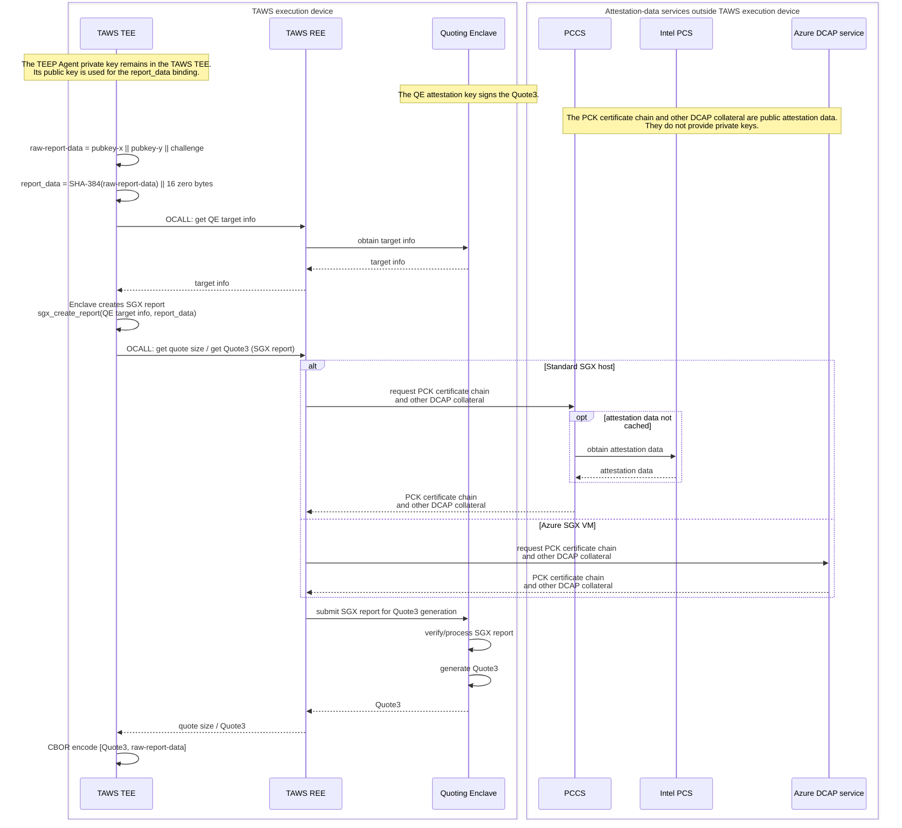

# Evidence Generation Design

## 1. Purpose and Scope
This document describes how the Enclave creates attestation evidence for a
`QueryResponse`.

- Target implementation: `Enclave/src/Enclave_generate_evidence.cpp`
- Caller: `process_query_request` in `Enclave/src/Enclave_process_message.cpp`
- In scope: Evidence generation, quote binding, and failure behavior.
- Out of scope: DCAP Quote verification details and PCCS/AESM deployment or
  configuration.

Evidence is generated only when
`QueryRequest.data_item_requested.attestation` is true.

## 2. Build-time Configuration and Output
| Build setting | Evidence format | `attestation_payload` |
| --- | --- | --- |
| `SGX_EVIDENCE=1` (default) | `application/sgx-quote3-teep-bundle` | CBOR array containing a Quote3 and raw report data |
| `SGX_EVIDENCE=0` | `application/eat+cwt; eat_profile="urn:ietf:rfc:rfc9711"` | Generic EAT payload wrapped in COSE Sign1 |

The resulting payload and its format are included in the `QueryResponse`.
The external payload contract is defined in
[external-design-teep-tam-exchange.md](./external-design-teep-tam-exchange.md).

## 3. SGX DCAP Evidence Flow
For `SGX_EVIDENCE=1`, the Enclave performs the following steps:

1. Construct raw report data from the TEEP Agent P-256 public-key coordinates
   and the `QueryRequest` challenge.
2. Compute SHA-384 over the raw report data and place the 48-byte digest in
   the beginning of the 64-byte SGX `report_data`; the remaining 16 bytes are
   zero.
3. Call the DCAP Quote Generation API through an OCALL to obtain
   Quoting Enclave (QE) target information, then create an SGX report addressed
   to the QE.
4. Call the DCAP Quote Generation API through OCALLs to obtain the required
   quote size and then the DCAP Quote3. The API implementation submits the SGX
   report to the QE, which verifies/processes the report and generates the
   quote. The QE and Quote Generation API are separate components.
5. Encode the Quote3 and raw report data as the following CBOR array:

The TAWS Enclave does not retrieve DCAP collateral directly. The Quote
Generation API implementation uses the attestation-data source appropriate to
its execution environment. This data includes the PCK certificate chain used
to validate the Quote signature, as well as other DCAP collateral such as
revocation and TCB information. On a standard SGX host this is normally PCCS,
which obtains and caches the data from Intel PCS when needed. On an Azure SGX
VM, the Azure DCAP Client integration uses the Azure DCAP service instead.

```cbor-diag
[
  raw-dcap-quote3,
  raw-report-data
]
```



## 4. Generic EAT Evidence
`SGX_EVIDENCE=0` is a development and compatibility mode. It does not create
an SGX report or DCAP Quote3.

`create_evidence_generic()` creates an EAT payload and wraps it in COSE Sign1.
The EAT confirmation claim contains the TEEP Agent P-256 public key and key
identifier. Its nonce is the `QueryRequest` challenge when present; otherwise,
the implementation uses its default EAT nonce.

Use `SGX_EVIDENCE=1` when SGX DCAP Quote3-based remote attestation is required.
The generic EAT field-level format and its verification are intentionally left
to the applicable EAT/COSE specification and implementation.

## 5. Trust Binding and Verifier Responsibilities
`raw-report-data` has the following form:

```text
TEEP Agent public key x-coordinate || TEEP Agent public key y-coordinate || QueryRequest challenge
```

The SHA-384 digest of this value binds the Quote3 to the TEEP Agent key and
the TAM challenge. The TAM or verifier must:

1. Validate the Quote3 according to its DCAP verification policy, including
   signature, certificate chain, and TCB status. Obtain any verification
   collateral through the verifier's DCAP policy and environment; a Quote3 is
   not assumed to always contain a complete collateral set.
2. Recreate `raw-report-data` from the public key and challenge used for the
   TEEP session.
3. Compare `SHA384(raw-report-data)` with the first 48 bytes of Quote3
   `report_body.report_data`, and verify that the remaining 16 bytes are zero.

## 6. Failure Behavior
If Evidence creation fails, `process_query_request` returns an
`ERROR_MESSAGE` containing `TEEP_ERR_CODE_TEMPORARY_ERROR`.

| Failure point | Examples |
| --- | --- |
| Input or allocation | Invalid key/challenge, insufficient buffer, allocation failure |
| SGX operation | SHA-384 or `sgx_create_report` failure |
| DCAP Quote Generation API OCALL | QE target-info, quote-size, or Quote3 acquisition failure |
| Payload signing or encoding | COSE signing or CBOR encoding failure |

## 7. Related Documents and Tests
- Caller flow and state behavior: [enclave-process-message.md](./enclave-process-message.md)
- External TAM contract: [external-design-teep-tam-exchange.md](./external-design-teep-tam-exchange.md)
- Data-flow view: [internal-design-dfd-dataflow.md](./internal-design-dfd-dataflow.md)
- DCAP integration tests: `App/tests/create_evidence_dcap_integration_test.cpp` and `App/tests/process_query_request_dcap_integration_test.cpp`
