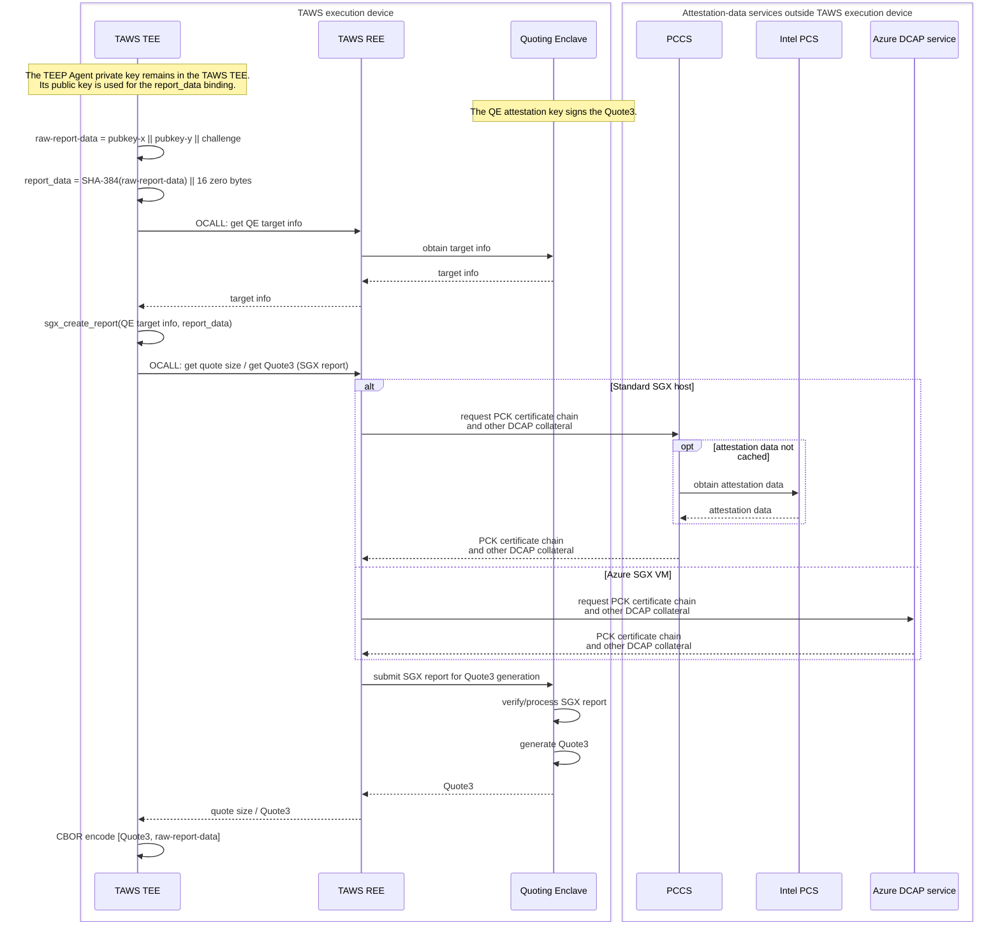

# Evidence Generation Design

## 1. Purpose and Scope
This document describes how the Enclave creates attestation evidence for a
`QueryResponse`.

- Target implementation: `Enclave/src/Enclave_generate_evidence.cpp`
- Caller: `process_query_request` in `Enclave/src/Enclave_process_message.cpp`
- In scope: Evidence generation, quote binding, and failure behavior.
- Out of scope: DCAP Quote verification details and PCCS/AESM deployment or
  configuration.

Evidence is generated only when
`QueryRequest.data_item_requested.attestation` is true.

## 2. Build-time Configuration and Output
| Build setting | Evidence format | `attestation_payload` |
| --- | --- | --- |
| `SGX_EVIDENCE=1` (default) | `application/sgx-quote3-teep-bundle` | CBOR array containing a Quote3 and raw report data |
| `SGX_EVIDENCE=0` | `application/eat+cwt; eat_profile="urn:ietf:rfc:rfc9711"` | Generic EAT payload wrapped in COSE Sign1 |

The resulting payload and its format are included in the `QueryResponse`.
The external payload contract is defined in
[external-design-teep-tam-exchange.md](./external-design-teep-tam-exchange.md).

## 3. SGX DCAP Evidence Flow
For `SGX_EVIDENCE=1`, the Enclave performs the following steps:

1. Construct raw report data from the TEEP Agent P-256 public-key coordinates
   and the `QueryRequest` challenge.
2. Compute SHA-384 over the raw report data and place the 48-byte digest in
   the beginning of the 64-byte SGX `report_data`; the remaining 16 bytes are
   zero.
3. Call an OCALL to obtain Quoting Enclave (QE) target information, then create an SGX report addressed
   to the QE.
4. Call OCALLs to obtain the required quote size and then the DCAP Quote3.
   The REE submits the SGX report to the QE, which verifies/processes the report and generates the quote.
5. Encode the Quote3 and raw report data as the following CBOR array:

```cbor-diag
[
  raw-dcap-quote3,
  raw-report-data
]
```



## 4. Generic EAT Evidence
`SGX_EVIDENCE=0` is a development and compatibility mode.
`create_evidence_generic()` returns an [RFC 9711](https://datatracker.ietf.org/doc/rfc9711/)
EAT payload wrapped in COSE Sign1. The EAT confirmation claim contains the
TEEP Agent P-256 public key and key identifier. Its nonce is the
`QueryRequest` challenge when present; otherwise, the implementation uses its
default EAT nonce. For individual EAT claim formats and verification details,
refer to RFC 9711.
