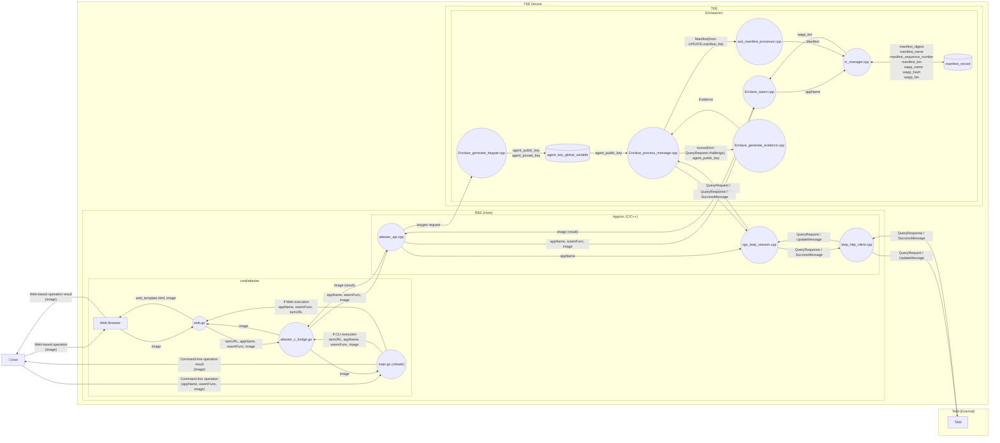
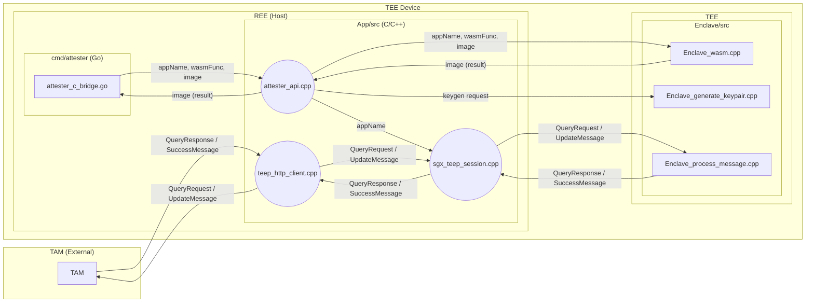

### 2.2 ファイル間API呼び出し図
この図はattester 内でどのファイルがどの API（関数）を呼び出しているかを追跡するための図である。




```cbor
tc-list: [
  {
    system-component-id: [h'6170702E7761736D'], ; "app.wasm"
    suit-parameter-image-digest: [
      -16,
      h'012345...'
    ]
  }
]
```


This diagram shows what data is exchanged around `attester/App` between the Go layer, Enclave, and TAM.
It focuses on key data paths (app_name, TEEP messages, inference input/output, and session results), not detailed control branches.

