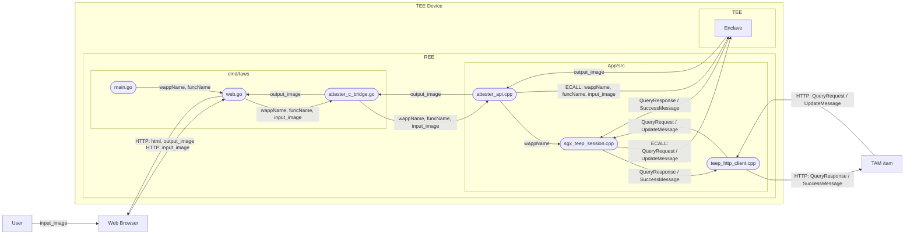
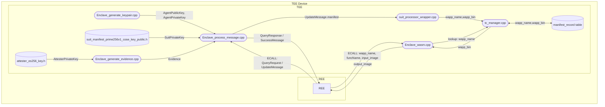
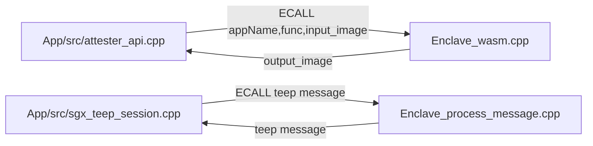

# Internal Design DFD Dataflow Details

## 1. Purpose
This document helps engineers inspect data flow within their own responsibility area (REE, TEE, or REE-TEE boundary).
It defines file/module-level data exchanges for impact analysis and design review.

## 2. Scope
- In scope: REE <-> TEE data flow for WASM invocation and TEEP session handling.
- In scope: TAM communication path and SUIT-to-record storage path.
- Out of scope: line-by-line implementation details.

## 3. Split DFD Views
### 3.1 REE DFD

### 3.2 TEE DFD

### 3.3 REE-TEE Boundary DFD

