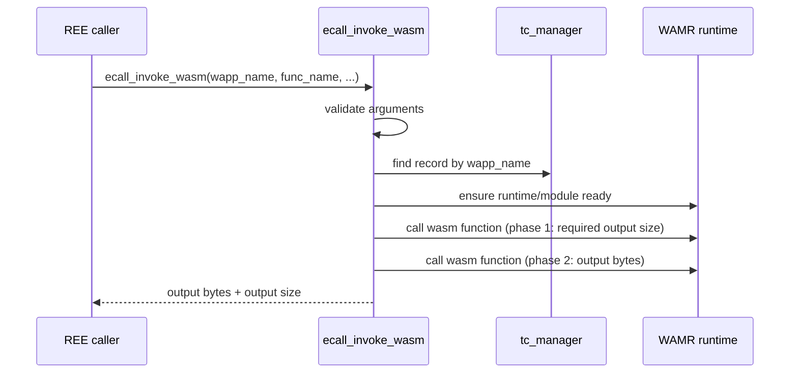

# invoke_wasm Design

## 1. Purpose
This document describes the high-level behavior and caller contract of `ecall_invoke_wasm`.

## 2. Scope
- Target implementation: `Enclave/src/Enclave_wasm.cpp`
- Related definition: `common/ecall_wasm_result.h`
- Caller implementation: `App/src/attester_api.cpp` (`attester_invoke_wasm`)

## 3. Process Flow
Entry point: `ecall_invoke_wasm`.  
Detailed interface contract is documented in `Enclave/Enclave.edl` (ECALL declaration).

The module executes a stored WASM app in Enclave using WAMR.
Before invocation, it ensures the target app is ready by checking tc_manager's records and runtime/module state.

Main flow:
1. Validate input arguments.
2. Ensure WAMR is ready for the target `wapp` (`ensure_wamr_running`).
3. Invoke the target function in two phases (required output size, then output bytes).
4. Return result code and output length to caller.

### 3.1 Sequence Diagram (`ecall_invoke_wasm`)

## 4. Failure Behavior Summary
- Invalid arguments: returns `ECALL_WASM_RESULT_INVALID_ARGUMENT`.
- Missing target record or empty wapp binary: returns `ECALL_WASM_RESULT_TRUSTED_COMPONENT_NOT_FOUND`.
- Runtime/module/buffer allocation failures: returns resource/internal/incompatible errors depending on failure stage.
- Invocation failures: returns `ECALL_WASM_RESULT_WASM_EXECUTION_FAILED`.
- Output capacity insufficient: returns `ECALL_WASM_RESULT_OUTPUT_BUFFER_TOO_SMALL`.

For exact failure-to-error mapping, refer to `Enclave/src/Enclave_wasm.cpp` and `common/ecall_wasm_result.h`.

## 5. Test Coverage Summary
### 5.1 Unit Tests
Target file: `Enclave/tests/enclave_wasm_invoke_test.cpp`

Covered behavior:
- Invalid argument handling
- Missing Trusted Component handling
- Runtime/module/resource failure handling
- WASM execution failure handling
- Output buffer too small handling
- Success path output copy and return values

## 6. Future Work
- Design an input ABI (for example CBOR) for invoking WASM functions with multiple arguments.
