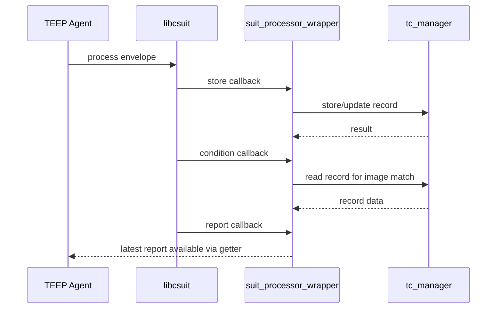

# SUIT Processor Design

## Audience and Intent
This document is for maintainers and handover engineers of the Enclave implementation.
Its purpose is to help readers quickly understand process flow, module boundaries, and failure behavior when changing SUIT-related processing.

## 1. Purpose
This document describes the high-level behavior of the SUIT callback wrapper module in Enclave.

## 2. Scope
- Target implementation: `Enclave/src/suit_processor_wrapper.cpp`
- Public header: `Enclave/inc/suit_manifest_process.h`

## 3. Process Flow
This module is a wrapper around [libcsuit callbacks](https://github.com/kentakayama/libcsuit/tree/master/examples/process#callback-functions) .

Main callback roles:
- Store callback: forwards SUIT store events to `tc_manager`.
- Condition callback: evaluates image match checks (size and digest) against TEE-side stored data.
- Report callback: stores the latest SUIT report for later retrieval.

### 3.1 Sequence Diagram (SUIT Callback Path)

## 4. Public and Callback Entry Points
| Entry Point | Purpose |
| --- | --- |
| `suit_get_suit_report` | Public API to return the latest stored SUIT report buffer for caller-side handling. |
| `__wrap_suit_store_callback` | Store callback entry point from `libcsuit`; forwards store data to `tc_manager`. |
| `__wrap_suit_condition_callback` | Condition callback entry point from `libcsuit`; evaluates image-match checks using TEE-side records. |
| `__wrap_suit_report_callback` | Report callback entry point from `libcsuit`; stores latest SUIT report for later retrieval. |

Detailed argument and return-value behavior is documented in `Enclave/inc/suit_manifest_process.h`.

## 5. Failure Behavior Summary
- Store callback failure: treated as fatal SUIT-side processing failure.
- Condition mismatch (size/digest): returns condition mismatch error and reason for report generation.
- Report callback failure (or allocation failure): report handling failure is returned.

Note: Exact `SUIT_ERR_*` mapping is defined in source code.

## 6. Related Modules and Tests
### 6.1 Related Modules
| Module | Role | Design Document |
| --- | --- | --- |
| `tc_manager` | Stores and retrieves trusted component records | [tc-manager.md](./tc-manager.md) |
| `enclave-process-message` | Calls SUIT processing from TEEP update path | [enclave-process-message.md](./enclave-process-message.md) |

### 6.2 Unit Test
Target file: `Enclave/tests/suit_condition_callback_test.cpp`

Covered checks:
- Missing stored payload
- Image size mismatch
- Digest mismatch
- Unsupported digest algorithm
- Success case
