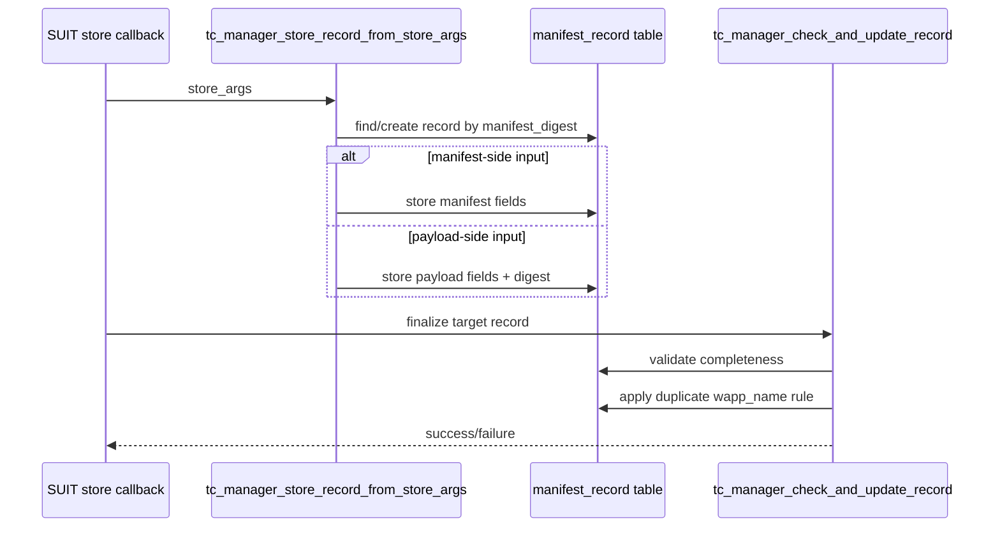

# TC Manager Design

## Audience and Intent
This document is for maintainers and handover engineers of the Enclave implementation.
Its purpose is to help readers quickly understand TC record lifecycle, update rules, and change impact points.

## 1. Purpose
`tc_manager` is an in-memory ledger module for Trusted Component (TC) records.
It stores manifest/payload data produced by SUIT processing and provides record lookup/list APIs for other modules.

## 2. Scope
- Target implementation: `Enclave/src/tc_manager.cpp`
- Public header: `Enclave/inc/tc_manager.h`

## 3. Module Responsibilities
- Store and update TC records keyed by `manifest_digest`
- Keep partial records until required elements are complete
- Finalize/discard records based on completeness and duplicate update rules
- Provide APIs that let other modules read stored records (for example, record lookup by app name/digest and TC list export for `QUERY_RESPONSE`).
- For persisted record fields, refer to `manifest_record_t` in `Enclave/inc/tc_manager.h`.

## 4. Process Flow
### 4.1 Store and Finalize Flow
1. Receive SUIT store input and find or allocate a target record.
2. Store manifest-side or payload-side fields based on callback input.
3. Finalization step validates completeness and applies duplicate-update policy.
4. Incomplete or lower-priority duplicate records are removed.

## 5. Design Policy
### 5.1 Partial Record Handling
Manifest data and payload data may arrive at different times.
`tc_manager` keeps partial records and finalizes only when required fields are complete.

### 5.2 Duplicate Update Rule
When multiple records have the same `wapp_name`, `manifest_sequence_number` is used:
- Existing `<=` New: keep new record, remove old record
- Existing `>` New: keep old record, remove new record

This keeps one latest record per `wapp_name` and prevents downgrade.

### 5.3 Deletion Strategy
Record deletion uses tail-swap compaction and decrements active length.
Variable-size buffers (`manifest_digest`, `manifest_bin`, `wapp_bin`) are freed on delete.

## 6. Public API Summary
| API | Purpose |
| --- | --- |
| `tc_manager_store_record_from_store_args` | Store callback input into TC record |
| `tc_manager_check_and_update_record` | Finalize and apply duplicate policy |
| `tc_manager_find_record_by_digest` | Lookup by `manifest_digest` |
| `tc_manager_find_record_by_wappname` | Lookup by `wapp_name` |
| `tc_manager_get_tc_list` | Export TC list items for response generation |
| `tc_manager_record_count` | Get active record count |
| `tc_manager_dump_records` | Print current records to debug log |
| `tc_manager_remove_all` | Remove all records |

Note:
- Detailed argument/field definitions are available in source/header.
- Exact error-code mapping is implementation-defined; refer to source code.

## 7. Failure Behavior Summary
- Invalid input (for example `NULL`, unsupported operation): API returns failure.
- Record allocation/storage failure: API returns failure and target update is not finalized.
- Finalization failure (missing required fields / invalid target digest): API returns failure.
- Capacity/output contract failure in list export: API returns failure.

## 8. Test Coverage Summary
### 8.1 Unit Tests
- Store/finalize behavior for manifest-only, payload-only, and complete-record cases
- Duplicate `wapp_name` update/discard rule by sequence number
- TC list export contract (count, capacity, invalid input)

Targets:
- `Enclave/tests/manifest_record_store_test.cpp`
- `Enclave/tests/tc_manager_get_tc_list_test.cpp`

### 8.2 Integration/Regression Tests
- End-to-end update flow validation including `tc_manager` state after real update messages

Target:
- `Enclave/tests/tc_update_integration_test.cpp`

## 9. Related Documents
- TEEP message flow integration: [enclave-process-message.md](./enclave-process-message.md)
- SUIT callback wrapper behavior: [suit-processor.md](./suit-processor.md)
