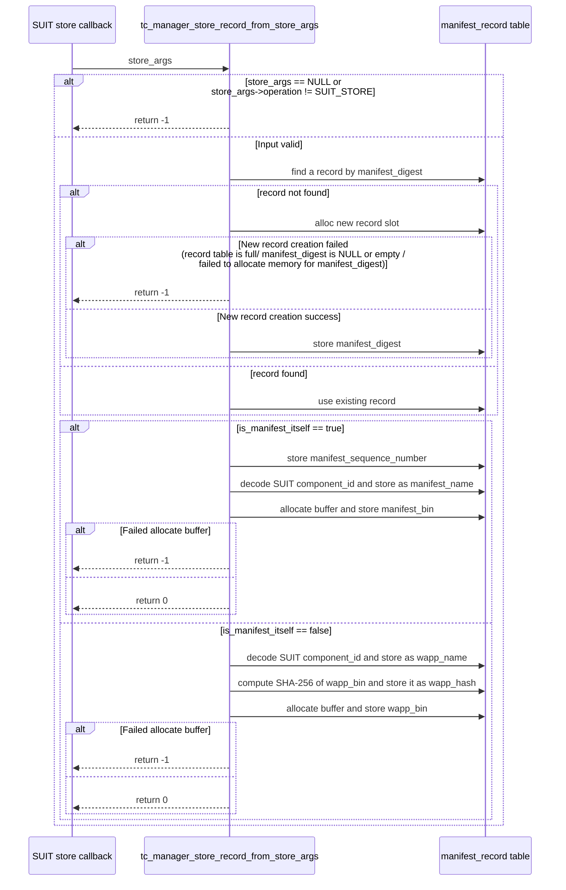

# TC Manager Design

## 1. Purpose
This document organizes the responsibilities, data model, public APIs, and update rules of `tc_manager`.
It is intended as a reference when reading the implementation (`Enclave/src/tc_manager.cpp`).

## 2. Module Overview
`tc_manager` does not execute TEEP/SUIT processing itself.
It is a ledger-management module that stores and organizes Trusted Component (TC) information produced by those processing flows.

Main roles:
- Store, find, and remove TC information (in-memory record management)
- Decide whether all required elements of a record are present (manifest + app data complete)
- When multiple records have the same `wapp_name`, compare `manifest_sequence_number` and keep the selected one

## 3. Scope
- Target implementation: `Enclave/src/tc_manager.cpp`
- Public header: `Enclave/inc/tc_manager.h`

## 4. Data Structures and Public APIs
A `manifest_record` is one internal record for one SUIT manifest application unit.
A single record stores both manifest-side information (name, sequence number, binary) and payload-side information (WAPP name, hash, binary).

### 4.1 Fields of `manifest_record_t`
| Field | Type | Description |
| --- | --- | --- |
| `manifest_digest` | `UsefulBuf` | Record identifier. Stores digest from SUIT callback and is used as a lookup key. |
| `manifest_name` | `char[SUIT_MAX_NAME_LENGTH]` | Manifest name restored from manifest-side component_id. |
| `manifest_sequence_number` | `uint64_t` | Manifest version. |
| `manifest_bin` | `UsefulBuf` | Stored manifest binary. |
| `wapp_name` | `char[SUIT_MAX_NAME_LENGTH]` | App name restored from payload-side component_id. |
| `wapp_hash` | `uint8_t[SHA256_DIGEST_LENGTH]` | SHA-256 hash of `wapp_bin`. |
| `wapp_bin` | `UsefulBuf` | Stored WAPP binary. |

### 4.2 Internal Management Data
| Field | Type | Description |
| --- | --- | --- |
| `g_manifest_records` | `manifest_record_t[]` | Table that stores records. |
| `g_manifest_record_len` | `size_t` | Current number of active records. Managed with tail-swap deletion. |

### 4.3 API Specification (Signature, Arguments, Return Value)

```c
int tc_manager_store_record_from_store_args(suit_store_args_t *store_args)
```
- Purpose: Store data from a SUIT store callback into `manifest_record`.
- Arguments:
  - `store_args`: Input data from SUIT store callback (must not be `NULL`).
- Return value: `0` on success / `-1` on failure (TODO: define error categories).
- Side effects: Updates `g_manifest_records`; allocates memory when needed.
- Failure conditions:
  - `store_args == NULL`
  - `store_args->operation != SUIT_STORE`
  - Failed to allocate a new record slot (record table full)
  - `store_args->manifest_digest` is `NULL` or empty
  - Memory allocation failure for `manifest_digest` / `manifest_bin` / `wapp_bin`

```c
int tc_manager_get_tc_list(tc_list_item_t *out_items, size_t capacity, size_t *out_count)
```
- Purpose: Export TC list for QueryResponse from records held by `tc_manager`.
- Arguments:
  - `out_items`: Output array (pre-allocated by caller)
  - `capacity`: Number of elements in `out_items`
  - `out_count`: Number of entries actually written
- Output fields:
  - `component_id`: String value from `wapp_name`
  - `tc_image_digest`: `wapp_hash` (SHA-256, 32 bytes)

  ```c
  typedef struct tc_list_item {
    char component_id[TC_COMPONENT_ID_MAX_LEN];
    uint8_t tc_image_digest[SHA256_DIGEST_LENGTH];
  } tc_list_item_t;
  ```
- Return value: `0` on success / `-1` on failure (TODO: define error categories).
- Failure conditions:
  - `out_count == NULL`
  - `capacity == 0` or `out_items == NULL`
  - `capacity` is smaller than current record count
  - Incomplete record or invalid `wapp_name` exists
- Note:
  - `tc_manager` returns raw digest bytes (`wapp_hash`).
  - Building SUIT_Digest format such as `[-16, digest]` (CBOR encoding) is done by the caller.

```c
const manifest_record_t *tc_manager_find_record_by_digest(UsefulBufC manifest_digest)
```
- Purpose: Find a record using `manifest_digest` as key.
- Argument: `manifest_digest` lookup key (`NULL`/empty is treated as no hit).
- Return value: Pointer to record if found, otherwise `NULL`.
- Side effects: None (read-only).

```c
const manifest_record_t *tc_manager_find_record_by_wappname(const char *wapp_name)
```
- Purpose: Find a record using `wapp_name` as key.
- Argument: `wapp_name` lookup key (`NULL`/empty string is treated as no hit).
- Return value: Pointer to record if found, otherwise `NULL`.
- Side effects: None (read-only).

```c
int tc_manager_check_and_update_record(UsefulBufC manifest_digest)
```
- Purpose: Finalize target record and clean up incomplete or duplicate records.
- Argument: `manifest_digest` key of record to verify/finalize.
- Return value: `0` on success / `-1` on failure (TODO: define error categories).
- Side effects: Removes incomplete records; updates/removes duplicates.
- Failure conditions:
  - No record exists for `manifest_digest`
  - Target record is incomplete (one or more of `manifest_name`, `wapp_name`, `manifest_bin`, `wapp_bin` is missing)

```c
size_t tc_manager_record_count(void)
```
- Purpose: Get current number of active records.
- Arguments: None.
- Return value: Current number of active records.
- Side effects: None.

```c
void tc_manager_dump_records(void)
```
- Purpose: Print stored record contents to debug log.
- Arguments: None.
- Return value: None.
- Side effects: Outputs current records to debug log.

```c
void tc_manager_remove_all(void)
```
- Purpose: Remove all stored records and return to initial state.
- Arguments: None.
- Return value: None.
- Side effects: Deletes all records and frees related memory.

## 5. Design Policy
### 5.1 Handling Until Record Finalization (Partial State + Finalization Condition)
In SUIT store callbacks, manifest data and WAPP payload may arrive at different times.
For this reason, `tc_manager` temporarily keeps partial records and finalizes them only when both sides are present.

`tc_manager_check_and_update_record()` finalizes a record only when all required fields are present; otherwise it discards the record.

### 5.2 Duplicate WAPP Update Rule
When the same `wapp_name` already exists, compare `manifest_sequence_number`.
- Existing `<=` New: keep new record, remove old record
- Existing `>` New: remove new record

This prevents downgrade and keeps one latest sequence per `wapp_name`.

### 5.3 Record Deletion
- Variable-size data (`manifest_digest`, `manifest_bin`, `wapp_bin`) is allocated/freed on record update and delete.
- On delete, swap target with tail entry and decrease count by one (no full compaction).
- `tc_manager_remove_all()` deletes all records and frees related memory.

## 6. Processing Flow
This document includes only the main flow: storing TC information (`tc_manager_store_record_from_store_args`).

### 6.1 TC Storage Flow (`tc_manager_store_record_from_store_args`)
1. Check that `store_args` is not `NULL`.
2. Find an existing record by `manifest_digest`. If not found, allocate a new record.
3. Save fields based on `is_manifest_itself` (whether input is manifest-side data).
- Manifest side: `manifest_sequence_number`, `manifest_name`, `manifest_bin`
- Payload side: `wapp_name`, `wapp_bin`, `wapp_hash (SHA-256)`

#### `store_args` (`suit_store_args_t`)
- For field-level description of `store_args`, see [suit-processor.md](./suit-processor.md).



## 7. Test Design

### 7.1 Unit Tests for `tc_manager_store_record_from_store_args`
Purpose:
- Verify store/finalize/update rules in `tc_manager` with minimal external dependencies.
- Make it easier to isolate failures to `tc_manager` logic.

Target: `Enclave/tests/manifest_record_store_test.cpp`

| Test focus | Covered case |
| --- | --- |
| Discard incomplete record when only manifest is stored | `test_manifest_only_is_incomplete` |
| Discard incomplete record when only app is stored | `test_app_only_is_incomplete` |
| Record becomes complete when both manifest + app are stored | `test_manifest_and_app_is_complete` |
| On duplicate `wapp_name`, update/discard by sequence comparison | `test_update_or_discard` |

### 7.1.1 Planned Additional Test Cases
Current tests prioritize core behavior: discarding incomplete records, finalizing complete records, and update/discard rules for duplicate `wapp_name`.
The following abnormal-input tests will be added.

| Not yet implemented | What to verify |
| --- | --- |
| Pass `store_args == NULL` to `tc_manager_store_record_from_store_args` | Returns `-1` as invalid input and does not change internal state |
| Pass `operation != SUIT_STORE` to `tc_manager_store_record_from_store_args` | Returns `-1` as unsupported operation and does not create/update records |
| Pass unregistered `manifest_digest` to `tc_manager_check_and_update_record` | Returns `-1` when target record does not exist |
| Pass input causing `dst` (component_id) decode failure in `tc_manager_store_record_from_store_args` | `manifest_name`/`wapp_name` remains unset and record is eventually discarded as incomplete |

### 7.2 Unit Tests for `tc_manager_get_tc_list`
Purpose:
- Verify output contract of `tc_manager_get_tc_list` (count, boundary conditions, return-value behavior) in isolation.

Target:
- Test implementation: `Enclave/tests/tc_manager_get_tc_list_test.cpp`

| Test focus | Covered case |
| --- | --- |
| Get list when two records exist | Register two records, call `tc_manager_get_tc_list`, verify return value `0`, `out_count == 2`, and each `component_id`/`wapp_hash` matches expected values |
| Get list when no records exist | Call `tc_manager_get_tc_list` with no records, verify return value `0` and `out_count == 0` |
| Invalid input: `capacity == 0` | Call with `capacity == 0`, verify failure `-1` and `out_count == 0` |
| Output array too small | Use `capacity < record_count`, verify return value `-1` and `out_count == 0` |
| Invalid input: `out_items == NULL` | Verify return value `-1` and `out_count == 0` |
| Invalid input: `out_count == NULL` | Verify return value `-1` |

### 7.3 Regression Tests for Update Flow Including `tc_manager`
Purpose:
- Use real Update messages (`update0` -> `update1`) to verify clean install/update results of `tc_manager`.
- Verify final behavior through the full path (COSE verification, TEEP decode, SUIT processing), not only `tc_manager` in isolation.
- `tc_update_integration_test.cpp` validates stored/updated `tc_manager` results after passing those full steps.

Targets:
- `teep-wasm-demo/testvector/prebuilt/update0.tam.esp256.cose`
- `teep-wasm-demo/testvector/prebuilt/update1.tam.esp256.cose`
- Test implementation: `Enclave/tests/tc_update_integration_test.cpp`

| Test focus | Covered case |
| --- | --- |
| Record state after first clean install (`update0.tam.esp256.cose`) matches fixed-vector expectations | Verify `record_count == 1`, `wapp_name == "app.wasm"`, `wapp_bin.len == 65132`, `manifest_sequence_number == 0`, `manifest_name == "manifest.app.wasm.0.suit"`, and `manifest_digest`/`manifest_bin` are non-empty |
| Record state after second update (`update1.tam.esp256.cose`) matches fixed-vector expectations | Verify `record_count == 1`, `wapp_name == "app.wasm"`, `wapp_bin.len == 65148`, `manifest_sequence_number == 1`, `manifest_name == "manifest.app.wasm.1.suit"`, and `manifest_digest`/`manifest_bin` are non-empty |

## 8. Future Work
- Design and implement processing to reflect externally fetched payloads specified by URI into records (`tc_manager_store_record_from_fetch_args`).
- Design and implement record persistence (current behavior keeps records only in memory for enclave process lifetime).
- Define `tc_manager`-specific error code categories and gradually replace uniform `-1` failure returns.
